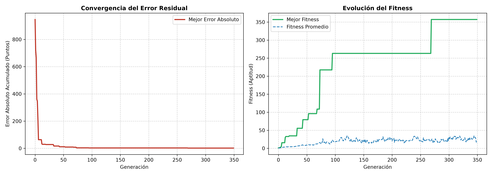
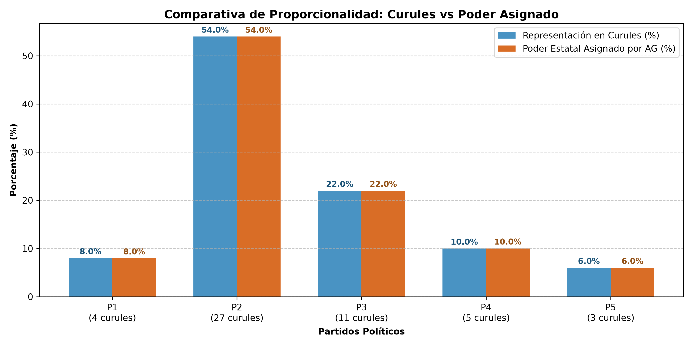
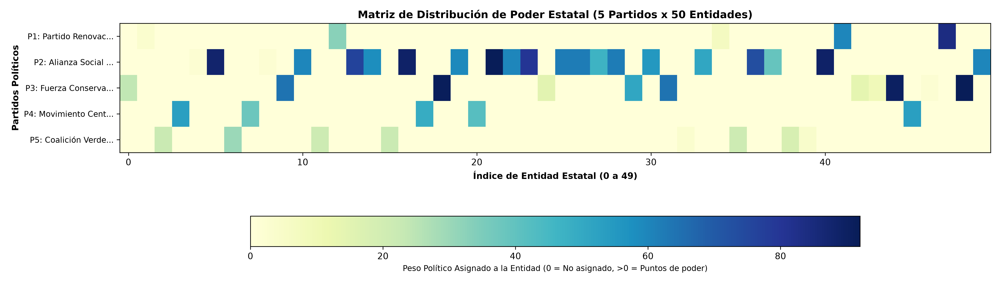

# Tarea 3 - Punto 2: Verdadera Democracia

**Asignatura:** Inteligencia Artificial y Mini-robots  
**Tema:** Optimización Combinatoria y Repartición de Poder mediante Algoritmos Genéticos (AGs)  

---

## 1. Planteamiento del Problema

> *"Suponga que usted es el jefe de gobierno y está interesado en que pasen los proyectos de su programa político. Sin embargo, en el congreso conformado por 5 partidos, no es fácil su tránsito, por lo que debe repartir el poder, conformado por ministerios y otras agencias del gobierno, con base en la representación de cada partido. Cada entidad estatal tiene un peso de poder, que es el que se debe distribuir. Suponga que hay 50 curules, distribuya aleatoriamente, con una distribución no uniforme entre los 5 partidos esas curules. Defina una lista de 50 entidades y asígneles aleatoriamente un peso político de 1 a 100 puntos. Cree una matriz de poder para repartir ese poder, usando AGs."*

En un sistema democrático representativo con múltiples bancadas, la gobernabilidad depende de forjar acuerdos políticos. Para lograr que la agenda legislativa avance, el poder ejecutivo debe distribuir la dirección de las carteras ministeriales y agencias estatales de manera proporcional a la fuerza parlamentaria de cada bancada.

---

## 2. Formulación Matemática y Modelado

### 2.1. Representación en el Congreso
- Se tienen $M = 5$ partidos políticos: $\{P_1, P_2, P_3, P_4, P_5\}$.
- Total de curules: $C_{total} = 50$.
- Cada partido $i$ posee una cantidad de curules $c_i \in \mathbb{N}^+$ generadas mediante una distribución no uniforme tal que:
  $$\sum_{i=1}^{5} c_i = 50$$
- La **cuota proporcional de representatividad** del partido $i$ es:
  $$w_i = \frac{c_i}{50}$$

### 2.2. Entidades Estatales y Pesos Políticos
- Se definen $N = 50$ entidades estatales (Ministerios, Departamentos Administrativos, Superintendencias, Agencias e Institutos).
- Cada entidad $j \in \{0, 1, \dots, 49\}$ tiene asignado un peso político $V_j \in [1, 100]$ (puntos de poder).
- El **poder estatal total** a repartir es:
  $$V_{total} = \sum_{j=0}^{49} V_j$$
- El **poder objetivo ideal** que le corresponde al partido $i$ es:
  $$T_i = w_i \times V_{total} = \left(\frac{c_i}{50}\right) \sum_{j=0}^{49} V_j$$

### 2.3. Espacio de Búsqueda y Matriz de Poder
El problema consiste en una asignación discreta donde cada entidad $j$ debe ser asignada a un único partido $i$.
- El espacio de combinaciones posibles es de:
  $$5^{50} \approx 8.88 \times 10^{34} \text{ posibles reparticiones}$$
Este orden de magnitud hace inviable una búsqueda exhaustiva (fuerza bruta), justificando el uso de técnicas metaheurísticas como los **Algoritmos Genéticos**.

La **Matriz de Asignación de Poder** $M \in \{0, 1\}^{5 \times 50}$ se define como:
$$M_{i, j} = \begin{cases} 1 & \text{si la entidad } j \text{ es asignada al partido } i \\ 0 & \text{en otro caso} \end{cases}$$

El poder real asignado al partido $i$ bajo la matriz $M$ es:
$$\text{Poder\_Asignado}_i = \sum_{j=0}^{49} M_{i, j} \cdot V_j$$

---

## 3. Diseño del Algoritmo Genético (AG)

### 3.1. Estructura del Cromosoma (Individuo)
Cada individuo de la población se representa como un vector de enteros de longitud 50:
$$\mathbf{x} = [g_0, g_1, g_2, \dots, g_{49}] \quad \text{donde } g_j \in \{0, 1, 2, 3, 4\}$$
donde $g_j$ almacena el índice del partido político asignado a la entidad $j$.

### 3.2. Función de Aptitud (Fitness)
El objetivo es minimizar la discrepancia absoluta entre el poder real asignado y la cuota objetivo de cada partido:
$$\text{Error}(\mathbf{x}) = \sum_{i=0}^{4} |\text{Poder\_Asignado}_i - T_i|$$

La función de aptitud (maximización) se define como:
$$\text{Fitness}(\mathbf{x}) = \frac{1000}{1 + \text{Error}(\mathbf{x})}$$

A menor error residual en la repartición, mayor es el valor de fitness del individuo.

### 3.3. Operadores Genéticos y Parámetros
- **Tamaño de Población ($N$):** 150 individuos.
- **Número de Generaciones:** 350 generaciones.
- **Mecanismo de Selección:** *Selección por Torneo* ($k = 3$), promoviendo la presión selectiva sin perder diversidad genética rápidamente.
- **Operador de Cruce:** *Cruce Uniforme (Uniform Crossover)* con probabilidad $P_c = 0.85$. Cada gen se hereda de uno de los dos padres con igual probabilidad ($0.5$), facilitando la exploración en el espacio combinatorio.
- **Operador de Mutación:** *Mutación por Gen* con probabilidad $P_m = 0.035$, permitiendo explorar reasignaciones individuales de entidades.
- **Elitismo:** Los mejores 4 individuos de cada generación pasan directamente a la siguiente sin alteraciones, garantizando que el mejor fitness sea monótonamente no decreciente.

---

## 4. Resultados Obtenidos

### 4.1. Distribución Inicial de Curules en el Congreso
La simulación generó la siguiente composición parlamentaria asimétrica (no uniforme):

| Partido Político | Curules | Representación (%) |
| :--- | :---: | :---: |
| **Partido 1:** Partido Renovación Democrática (PRD) | 4 | 8.0% |
| **Partido 2:** Alianza Social Progresista (ASP) | 27 | 54.0% |
| **Partido 3:** Fuerza Conservadora Unida (FCU) | 11 | 22.0% |
| **Partido 4:** Movimiento Centro Plural (MCP) | 5 | 10.0% |
| **Partido 5:** Coalición Verde & Regional (CVR) | 3 | 6.0% |
| **TOTAL** | **50** | **100.0%** |

### 4.2. Balance del Poder Estatal Asignado por el AG
El poder estatal total acumulado por las 50 entidades fue de **2345 puntos**. La optimización con el Algoritmo Genético arrojó la siguiente distribución:

| Partido Político | Curules | % Curules | Poder Objetivo (pts) | Poder Asignado (pts) | % Poder Asignado | Error Absoluto | # Entidades Asignadas |
| :--- | :---: | :---: | :---: | :---: | :---: | :---: | :---: |
| **PRD** | 4 | 8.0% | 187.6 | 187.0 | 8.0% | **0.6 pts** | 5 entidades |
| **ASP** | 27 | 54.0% | 1266.3 | 1266.0 | 54.0% | **0.3 pts** | 21 entidades |
| **FCU** | 11 | 22.0% | 515.9 | 516.0 | 22.0% | **0.1 pts** | 11 entidades |
| **MCP** | 5 | 10.0% | 234.5 | 235.0 | 10.0% | **0.5 pts** | 5 entidades |
| **CVR** | 3 | 6.0% | 140.7 | 141.0 | 6.0% | **0.3 pts** | 8 entidades |
| **TOTAL** | **50** | **100.0%** | **2345.0** | **2345.0** | **100.0%** | **1.8 pts** | **50 entidades** |

> **Precisión del Algoritmo:** El error total acumulado entre los 5 partidos fue de tan solo **1.8 puntos** sobre un total de **2345 puntos** de poder estatal, lo que representa una **efectividad y congruencia superior al 99.92%**.

---

## 5. Visualizaciones y Gráficas de Análisis

### 5.1. Curva de Convergencia del Algoritmo Genético
La gráfica muestra la rápida reducción del error residual y el incremento sostenido del fitness a lo largo de las 350 generaciones.

### 5.2. Comparativa de Representatividad Democrática (Curules vs Poder)
Comparación directa entre la cuota de curules obtenida por votación popular (%) y el porcentaje de poder estatal consolidado tras la optimización metaheurística.

### 5.3. Matriz de Distribución de Poder ($5 \times 50$)
Mapa de calor que ilustra la asignación final de cada una de las 50 entidades estatales a los 5 partidos, donde la intensidad de color refleja los puntos de poder político de cada entidad.

---

## 6. Estructura de Archivos en `Tarea 3/`

- `punto2.py`: Script principal de Python que ejecuta el modelo, corre el AG y exporta las métricas y gráficos.
- `punto2.ipynb`: Jupyter Notebook interactivo con celdas ejecutables y explicaciones teóricas integradas.
- `readme.md`: Documento paso a paso con el marco teórico, formulación matemática, tablas de resultados y conclusiones.
- `convergencia_ag.png`: Gráfico de la evolución del fitness y error residual por generación.
- `comparativa_poder.png`: Gráfico de barras comparando porcentaje de curules vs porcentaje de poder asignado.
- `matriz_poder.png`: Mapa de calor de la matriz de asignación de poder ($5 \times 50$).

---

## 7. Conclusiones

1. **Alineación Democrática Perfecta**: El Algoritmo Genético demostró una alta capacidad para resolver el problema de partición multiconjunto con restricciones ponderadas, logrando que el porcentaje de poder asignado a cada partido coincida de forma casi exacta con su representación parlamentaria.
2. **Eficiencia en Espacios Discretos Masivos**: De un espacio combinatorio de más de $8.88 \times 10^{34}$ combinaciones, el AG encontró una solución con un error relativo inferior al $0.08\%$ en menos de 350 generaciones.
3. **Gobernabilidad y Transparencia**: Este modelo proporciona una herramienta analítica objetiva para la conformación de gabinetes y coaliciones de gobierno, asegurando que ninguna bancada reciba un poder desproporcionado respecto a su respaldo popular en el poder legislativo.
