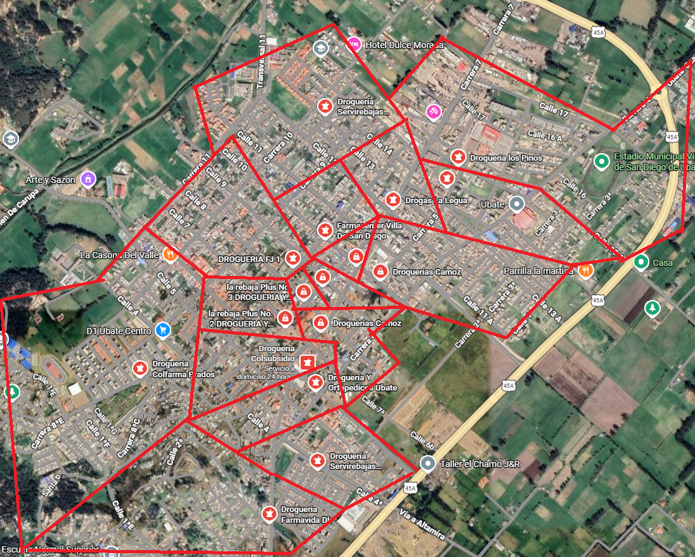
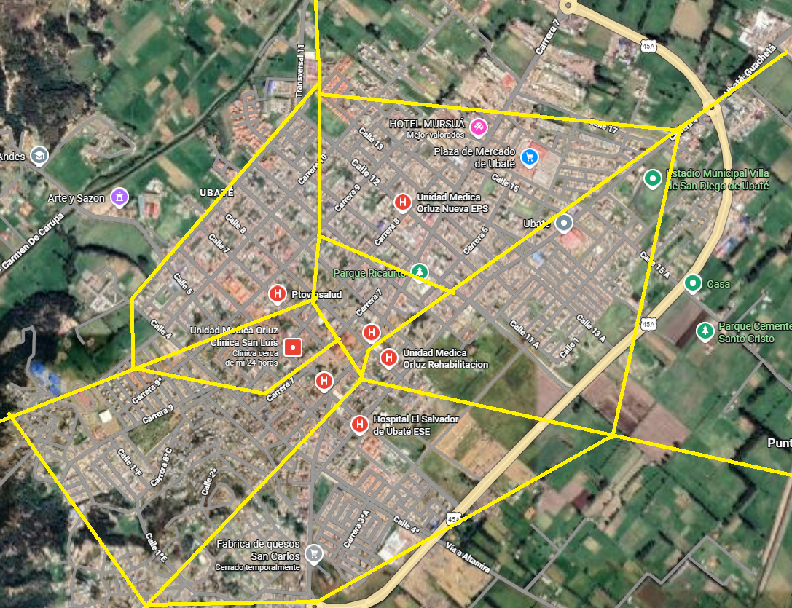
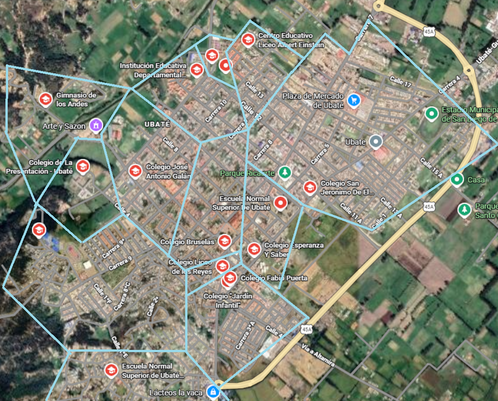

##  Tome el plano de una ciudad pequeña y localice, por ejemplo, las droguerías,  centros de atención de salud y colegios. Por cada concepto dibuje un diagrama de Voronoi. ¿Considera que puede faltar una droguería, o un centro de atención de salud o un colegio? ¿Hay alguna relación entre los diagramas? 

Los diagramas se realizaron sobre la ciudad de Ubaté ubicada en el departamento de Cundinamarca, como se puede observar en el diagrama de Voronoi para los hospitales, estos están todos concentrados en el centro de la ciudad, por lo que en la zona norte y sur de la ciudad haría falta un hospital.
En el diagrama de Voronoi para los colegios se puede ver que estos se encuentran distribuidos uniformemente en la ciudad, pero al igual que con los hospitales hay poca disponibilidad en la zona nor-oriente de la ciudad.
Respecto a la distribución de las farmacias en la ciudad se observa que están todas concentradas en el centro de la ciudad, en donde en los límites de la misma no se encuentra ninguna farmacia.
La relación que se pudo encontrar entre los tres diagramas es que en la zona noroccidente de la ciudad se encuentra una urbanización de conjuntos cerrados, los cuales no dejan espacio para zonas comerciales y servicios.
